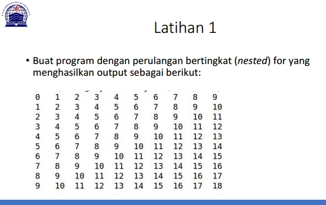
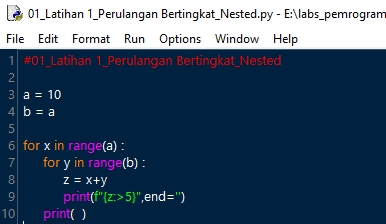
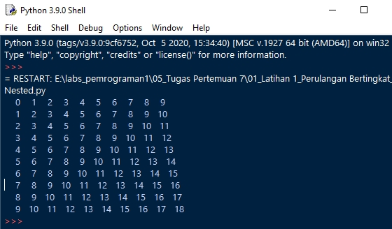
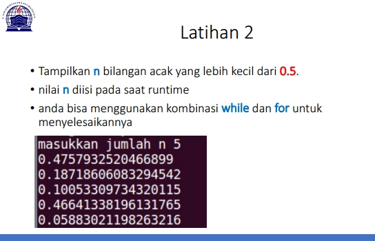
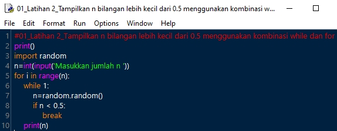
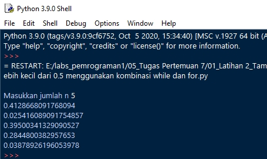

# 05_Tugas Pertemuan 7

BAHASA PEMROGRAMAN

TEKNIK INFORMATIKA

UNIVERSITAS PELITA BANGSA

NAMA : GUNAWAN

NIM     : 312010191

KELAS   : TI.20.B1

DOSEN   : Agung Nugroho,S.Kom.,M.Kom

Tugas : Pertemuan 7

**Latihan 1 : Program Perulangan beringkat (nested)**

- Kita ketik Code perintah python yang sudah kita buat nama Latihan1.py : 

Pada program menggunakan kode:

-Untuk Baris a dengan nilai 10 baris  dan b sebagai kolom.Nilai b=a,berarti 10 kolom.

- pengulangan bertingkat(nested) kita menggunakan ``for``

- Saya menggunakan f-string, fitur baru yang tersedia di Python 3.6 ke atas.

- untuk kode ``>5`` di mana >berarti rata kanan, dan 5 merupakan lebar.

Berikut tampilan hasil code program setelah di Run :

**Latihan 2 : Tampilkan n bilangan acak yang lebih kecil dari 0.5 menggunakan kombinasi while dan for**

- Kita ketik Code perintah python yang sudah kita buat nama Latihan2.py : 

Pada program menggunakan kode: 

- syntax ``random.random`` yang digunakan untuk mencari nilai random
- Sementara ``n=int(input(''))`` untuk menentukan jumlah input nilai n=5 atau nilai yang diinginkan oleh kita.

Berikut tampilan hasil code program setelah di Run :

Cukup sekian penjelasan dari saya.

**Terimakasih**